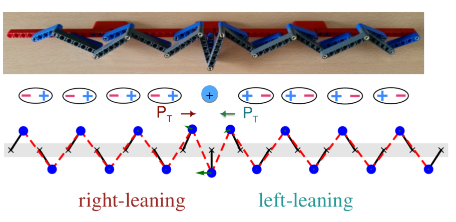
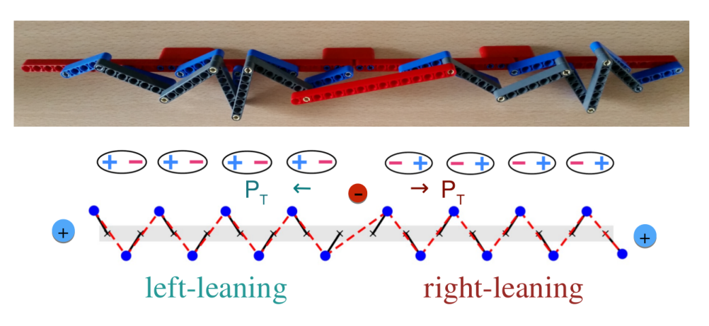
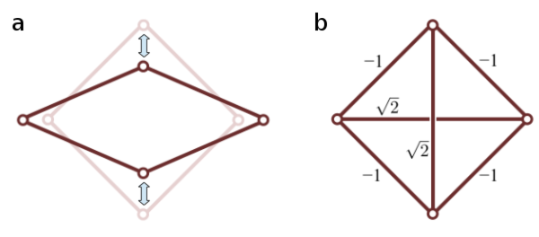
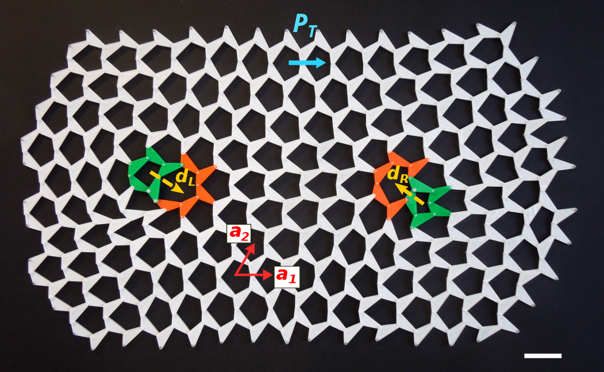
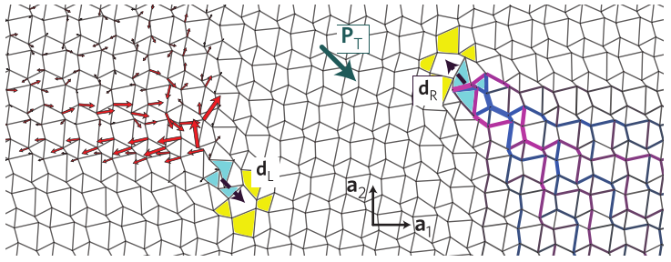

```python
import sys

sys.path.append("../../code")
from init_mooc_nb import *

init_notebook()
import topomech
```

# Introduction

Today's lecture will be given by Vincenzo Vitelli, from Leiden University. You will learn about topologically protected mechanical structures, that mirror the properties of topological insulators and quantum Hall systems.

The main concepts and mathematical ideas will be presented in the context of real mechanical prototypes. Hopefully, this approach will stimulate you to cross the line that too often separates theory from applications.


```python
MoocVideo("i-eNPei2zMg", src_location="10.2-intro")
```

The materials of this lecture are kindly provided by the Topological Mechanics lab at Leiden University: Vincenzo Vitelli (PI), Bryan Chen, Anne Meeussen, Jayson Paulose, Benny van Zuiden, and Yujie Zhou. They are copyright of their creators, and are available under a
<a rel="license"
href="http://creativecommons.org/licenses/by-sa/4.0/"
target="_blank">Creative Commons Attribution-ShareAlike 4.0
International License.</a>
<a rel="license"
href="http://creativecommons.org/licenses/by-sa/4.0/">
</a>

# Kink and anti-kink

Let's consider the chain you saw in the video:


In the figure, the red dashed lines represent springs and the green arrows the vibrational eigenvectors. The rigid rotors are in black, while the blue dots are point masses of magnitude $m$.

Imagine the system with periodic boundary conditions, that is on a closed ring. As you can see from the figure, in the bulk there are an equal number of degrees of freedom (the rotors) as there are constraints (the springs). This can be seen as a ‘‘charge neutrality‘‘ condition:


If you cut the ring, you remove one constraint, and now there is a zero energy mode in the system. We will discuss later that the direction the rotors lean plays a role of a ‘‘mechanical’’ polarization.

The constraint counting does not tell you where the mode will be located, but if you write the dynamical matrix and find the zero eigenmode, you will learn that the zero mode (whose eigenvectors are represented in the figure as green arrows) is localized at the edge towards which the rotors are pointing. Note that we are tacitly assuming that the vibrational modes of this structure are gapped. Convince yourself that the gap closes if the angle of repose, labeled by $\bar{\theta}$, is equal to zero.

A study of the vibrational modes of this chain was presented in the original paper of Kane and Lubensky, which was mentioned in the introductory video:

* arXiv:1308.0554

We shall now show that the zero mode localized at the edge is a time snaphot of a non-linear object, the kink that separates regions of left and right leaning rotors, a bit like a domain wall in an Ising model:



To see that, it is easier to consider the constraint equation $l^2_{n,n+1}=\bar{l}^2$ that demands that the length of the springs $l_{n, n+1}$ between any two rotors labeled by $n$ and $n+1$ is not stretched. This is certainly the case for the rigid bar systems shown in the video which correspond to the limit of infinite spring constant. Such systems are called [linkages](http://en.wikipedia.org/wiki/Linkage_%28mechanical%29).  

In terms of the parameters defined in the first figure, the constraint equation $l^2_{n,n+1}=\bar{l}^2$ reads

$$
\require{action}
\require{color}
\toggle{
\cos(\theta _{n} + \theta _{n+1}) - \cos(2\bar{\theta}) + \frac{a}{r}(\sin\theta _{n} - \sin\theta _{n+1})=0
\textit{ (click for explanation)}.}{
l^2 = r^2 (\cos\theta_1 + \cos\theta_2)^2 + [r(\sin\theta_1 - \sin\theta_2) + a]^2 \textit{ (click more)}
}{
l^2 = 2 r^2 + a^2 + 2r^2 \cos\theta_1\cos\theta_2 - 2r^2\sin\theta_1\sin\theta_2 + 2ar(\sin\theta_1 - \sin\theta_2) \textit{, and so}
}{
(l^2 - 2r^2 - a^2)/2r = \color{red}{r\cos(\theta_1 + \theta_2) + a(\sin\theta_1 - \sin\theta_2) = r\cos(2\bar{\theta})}
}
\endtoggle
$$

To take the continuum limit of the above equation, we define a slowly-varying angular field $\theta (x)$ and subsequently define the field $u(x)=r\sin\theta (x)$, the $x$-component of the position of the mass. When $r/a$ is sufficiently small, we obtain

$$
\frac{a^2}{2}\frac{du}{dx} = u^2-\bar{u}^2,
$$

where $\bar u\equiv |r\sin\bar\theta|>0$. Besides the uniform left- and right-leaning solutions
$u(x)=\pm \bar u$, this equation admits only one *zero-energy* solution (for $u<\bar{u}$) given by the kink

$$
u(x) = \bar u\tanh\left(\frac{x-x_0}{w_0}\right),
$$

where $w_0=a^2/2\bar u$ is the width of the static domain wall that interpolates between left-leaning ($u<0$ as $x\rightarrow-\infty$) and right-leaning ($u>0$ as $x\rightarrow+\infty$) states.


```python
question = r"What happens to the kink width $w_0$ when the gap closes?"

answers = ["It goes to zero.", "It does not vary.", "It diverges."]

explanation = (
    r"We said that a gap equal to zero corresponds to $\bar{\theta}\to0$. "
    r"This gives $w_0 = a^2/2\bar{u}d \propto 1 / |\sin \bar\theta \to \infty$."
)

MoocMultipleChoiceAssessment(
    question=question, answers=answers, correct_answer=2, explanation=explanation
)
```

# Non-linear dynamics

You can explicitly obtain a continuum Lagrangian for the chain which, in the limit $l(x)\approx\bar{l}$ and $\bar{\theta}\ll 1$, reads:

$$
\mathcal{L}=\int dx \left[\frac{1}{2}M\left(\frac{\partial
u}{\partial t}\right)^2 -
\frac{1}{2}K\frac{a^4}{4}\left(\frac{\partial u}{\partial
x}\right)^2 -\frac{1}{2}K(\bar u^2-u^2)^2 - \frac{1}{2} K \frac{a^2}{2}(\bar
u^2-u^2)\frac{\partial u}{\partial x}\right].
$$

The first term is a linearized kinetic energy, while the second and third terms are the ordinary [$\phi^4$ field theory](http://en.wikipedia.org/wiki/Quartic_interaction) that you might have encountered for instance while studying the Ising model.

The final term linear in $\partial_x u$ is topological in the sense that it integrates to the boundary. It ensures that the static kink has zero energy, since the last three terms in the Lagrangian can be combined into a perfect square, that vanishes for the static kink solution (this is sometimes called a BPS state). The topological boundary term does not affect the equations of motions in the bulk, but it breaks the $\partial_x u \rightarrow -\partial_x u$ symmetry of the $\phi^4$ theory. That's why the two edges are not equivalent in terms of initiating the kink motion.

The anti-kink solution (with left- and right-leaning states reversed in space) costs a finite stretching energy. Hence, the anti-kink is forbidden in the ground state represented by the linkage limit, where $k_e \rightarrow \infty$. The anti-kink would require an opposite choice of sign in front of the topological boundary term.

As discussed in the introductory video, however, something that behaves like an anti-kink can be obtained if we stick in the system a rigid bar much longer than the others:



Rather than analyzing mathematically the dynamics of the Lagrangian above, watch the two videos below that
show the motion in the linkage limit.


```python
MoocVideo("BE4NDhfdpBQ", src_location="10.2-topological-linkages-I")
```


```python
MoocVideo("mRjpzC4rJx0", src_location="10.2-topological-linkages-II")
```

If you are curious about the mathematical details and a systematic study of the dynamics in the springs-rotors system, you can check out the following paper:

* arXiv:1404.2263

Note that with different geometrical parameters, the same chain above can realize the [sine-Gordon Lagrangian](http://en.wikipedia.org/wiki/Sine-Gordon_equation). As before, check out the following movie:


```python
MoocVideo("w2k1Y0WON2E", src_location="10.2-topological-linkages-III")
```

The same reference above contains hints on how to build this structure with LEGO - plus of course all the mathematical details!

# Zero modes and states of self-stress

At this point we could expand around the kink solution and find a zero mode localized at its center where the gap closes. Such a zero mode allows the kink to translate as shown in the linkage video.

For now we will simply remark that if one views the orientation along which the rotors lean as a mechanical polarization, then there will be an excess positive ‘‘charge’’ corresponding to a soft mode at the kink center and a negative one at the anti-kink (see the last two figures). Never mind if this electrostatic analogy is not yet clear; we will return to it and show that the antikink harbours a so-called ** state of self stress**, a dual state to the zero mode.  

Before doing that we need to review the Maxwell count which is a **global** relation that stipulates that the number of zero modes $n_\text{m}$, present in an arbitrary mechanical structure, is simply given by the difference between the number of degrees of freedom minus the number of **independent** constraints.

For simplicity, assume that the mechanical structure under examination can be viewed as a network composed of $N_\text{s}$ sites (for instance point masses) connected by $N_\text{b}$ central force bonds (for instance springs or rigid beams) in $d$ dimensions. In this case, the number of degrees of freedom is given by $d N_\text{s}$ and the **total** number of constraints is simply $N_\text{b}$. The states of self-stress are the **redundant** constraints present in the structure, whose number we denote by $n_{ss}$.

The Maxwell criterion then reads

$$
d N_\text{s} - N_\text{b} = n_{m} - n_{ss}\,.
$$

Let's apply this equation to the following examples of mechanical structures:



Note that on the left panel there are 4 sites in 2 dimensions, hence 8 degrees of freedom. There are also 4 bonds which leaves 4 soft modes, as prescribed by the Maxwell criterion. You can easily verify that there are 2 trivial translational and 1 rotational zero modes plus 1 non-trivial zero mode, the one indicated by the arrows in the figure.

If you add two extra bonds along the diagonals, as in the right panel, the left hand side of the Maxwell count gives 2. Now, the 3 translations and rotations are still there, the non-trivial zero mode is no longer present but there is one redundant constraint or state of self stress. The difference between the 3 trivial zero modes and the state of self stress gives
indeed 2, again as expected from the Maxwell criterion. Here we will denote structures for which the left hand side of the Maxwell count is zero as **isostatic**.

(Note that this is an abuse of terminology.  Strictly speaking, isostatic
structures have $dN_{\text{s}}-n_{m,\text{triv}}=N_\text{b}$ and $n_{ss}=0$, where
$n_{m,\text{triv}}$ is the number of translations and rotations in $d$
dimensions.)

As a simple test of your knowledge, consider the following question whose answer will prove handy later.


```python
question = (
    r"What is the number of bonds $z_c$ emanating from each node in a $d$-dimensional isostatic structure "
    "where all nodes have the same number of bonds (neglecting boundaries)?"
)

answers = [r"$z_c=d$.", r"$z_c=2d$.", r"$z_c=d(d-1)$.", r"$z_c=d^2$."]

explanation = (
    "In an isostatic structure we have equal number of degrees of freedom and number of constraints. "
    "This gives the equation $d N = z N /2$, because each bond is shared by two sites."
)

MoocMultipleChoiceAssessment(
    question=question, answers=answers, correct_answer=1, explanation=explanation
)
```

Why do we call redundant constraints with the name *states of self stress*?

Consider the example in the right panel of the figure. Note that if you apply a suitable distribution of stresses  in the bonds, the structure will remain in static equilibrium. In the example, you can apply a compression to the vertical and horizontal bars, which corresponds to an outgoing force on the masses, and a tension on the diagonal bars such that this outgoing force is canceled. The numbers next to the springs in the figure (positive for the compressions, negative for tensions) give the right ratios such that the forces cancel.

We see therefore that states of self stress are assignments of tensions or compressions to (some of) the bonds that do not result in net forces on the nodes. As such, they are *dual* to the zero energy mechanical modes, which are displacements of some of the sites that do not result in tensions or compressions of the bonds (that's why they cost zero elastic energy).

This relation between states of self stress and zero modes can be made more precise by introducing the rigidity, or compatibility, matrix $R_{ij}$ that describes the small distortions of the mechanical structure captured by linear elastic theories. This $R$ matrix relates the bond extensions $e_i = R_{ij} u_j$ to the site displacements $u_j$.

The zero energy modes are members of the null space of $R_{ij}$, which in an isostatic system are also the (right) eigenvectors of $R_{ij}$ with eigenvalue 0. (Convince yourself that the rigidity matrix is square for an isostatic system.)

Conversely the states of self stress are the zero eigenvectors  of the transpose matrix $R^{T}$ that relates the forces on the nodes to the tensions in the bonds. The Maxwell count equation follows from the rank-nullity theorem and can be expressed as an index theorem. (We suggest the reader interested in a careful proof and statement of these results to consult [this review](http://arxiv.org/abs/1503.01324).)

Here we merely remark that if one smoothly deforms the network without cutting bonds or adding sites then the left hand side of the Maxwell count does not change. This means that after such a smooth deformation, the difference between the number of zero modes and states of self stress must remain invariant even if $n_m$ and $n_{ss}$ change individually. In this sense the isostatic condition can be viewed as a charge neutrality condition. As we shall see,  this electrostatic analogy is far reaching. We will now turn our attention to periodic mechanical structures that are isostatic, hence ‘‘charge neutral’’, but mechanically polarized so that edge modes can appear at the sample boundary like charges in an electrically polarized medium.

# Topological band theory

The first step is to set up a topological band theory of vibrational modes by defining the Fourier-transformed rigidity matrix $R(\mathbf{k})$ whose determinant is complex: $\det R(\mathbf{k}) \equiv |\det R(\mathbf{k})|e^{i\phi(\mathbf{k})}$. Consider now for simplicity a two dimensional lattice whose phonons are gapped, away from $\mathbf{k}=\mathbf{0}$, like the twisted Kagome lattice shown at the end of the introductory video.

Two winding numbers,
$n_i=\{n_1,n_2\}$, of $\phi(\mathbf{k})$ can be evaluated using

$$
n_i=- \frac{1}{2\pi}\oint_{C_i}d\mathbf{k}\cdot\nabla_\mathbf{k}
\phi(\mathbf{k})
$$

along the two cycles $\{C_1,C_2\}$ of the Brillouin zone corresponding to the reciprocal lattice directions orthogonal to the basis vectors $\{\mathbf{a}_1,\mathbf{a}_2\}$ of the lattice. The winding numbers are invariants of the gapped lattice; smooth
deformations do not change $n_i$ unless the lattice becomes untwisted and the phonon gap closes along a line in the Brillouin zone. We can now define the topological polarization

$$
\mathbf{P}_T   = \sum_i n_i \mathbf{a}_i.
$$

In the figure below, the topological polarization of the deformed Kagome lattice is $\mathbf{P}_T = \mathbf{a}_1$ in terms of the primitive vectors $\mathbf{a}_i$.



Kane and Lubensky proved that the number of topological zero modes (i.e. modes that arise without adding or removing bonds anywhere in the structure) minus the number of topological states of self stress, $\nu_\text{T}$, in any lattice subsystem bounded by $\cal C$ is given by

$$
\nu_\text{T} = \oint_{\cal C} \frac{d^{d-1}S}{V_\text{cell}} \mathbf{P}_T  \cdot\hat{n},
$$

where $\hat{n}$ is the inward-pointing normal to the boundary, and $V_\text{cell}$ is the $d$-dimensional volume of the unit cell.

Notice that this result applies to a **patch** of the material, unlike the original Maxwell count which is a **global** statement. It can be understood intuitively with the aid of the electrostatic analogy to polarized media. Just as Gauss's law yields the net charge enclosed in a region from the flux of the *electric* polarization through its boundary, the net
value of $\nu_\text{T}$ in an arbitrary portion of an isostatic lattice is given by the flux of the *topological* polarization through its boundary.

# Dislocations and topological zero modes

Watch now the following video that explains visually how to insert inside a twisted Kagome lattice a topological defect called a dislocation. You encountered dislocations and disclinations in a previous lecture by Taylor Hughes. (Alternatively, an excellent introduction to topological defects is given in chapter nine of the book by Chaikin and Lubensky, *Principles of Condensed Matter Physics*). The video will show you how to localize topological zero modes or states of self stress in the interior of a lattice with defects that act as internal boundary where the gap locally closes.


```python
MoocVideo("Mrm7JH6LJJI", src_location="10.2-dislocations")
```

The key point in designing the lattice in the video  is that the dislocations must not change the local balance between degrees of freedom and constraints. The video shows such a dislocation, obtained by pairing a five-coordinated plaquette with a seven-coordinated plaquette.

More details can be found in this paper:

* arXiv:1406.3323

Since no lattice point disclinations are used, every lattice point still has exactly four bonds emanating from it (remember the condition for isostaticity from the first control question!).

Each dislocation is characterized by a topological charge of its own called the Burgers vector, $\bf b$, that measures the deficit in *any* circuit surrounding it that would be closed in a perfect lattice. The dipole moment, $\bf d$, of the
five- and seven-fold coordinated plaquettes (highlighted in green and orange respectively)
is obtained upon rotating $\bf b$ by $\pi/2$. It points outward from the added strip of material that terminates at the dislocation, and its length is equal to the width of that strip. Therefore, $\bf d$ quantifies the orientation and size of the effective ‘‘edge’’ created by the dislocation. The dipole moments of the dislocation on the left in the video (${\bf d}_l = (2/\sqrt{3})({\bf a}_1- {\bf a}_2/2)$)  and on the right (${\bf d}_r =-{\bf d}_l$) are aligned with and against the
lattice polarization, respectively (see also the last figure).

If you evaluate the flux of the topological polarization, $\mathbf{P}_T$, through a contour encircling an isolated dislocation using the last equation of the previous unit, you obtain

$$
\nu_\text{T} =\frac{1}{V_\text{cell}}\mathbf{P}_T  \cdot  \mathbf{d},
$$

where $V_\text{cell} = |\,\textbf{a}_1\,\times\,\textbf{a}_2\,|$ is the unit cell area. The topologically protected modes arise from a delicate interplay between
a Berry phase associated with cycles in the Brillouin zone, embedded in ${\bf P}_T$, and the Berry phase of a topological
defect in real space, represented by its Burgers vector (or dipole $\mathbf{d}$).

A similar interplay dictates the existence of localized electronic modes at dislocations in conventional topological insulators. One obtains $\nu_\textrm{T}=+1\,(-1)$ for the left (right) dislocation in the deformed Kagome lattice shown in the figure and in the video. The sign of $\nu_\text{T}$  distinguishes zero modes ($+$) or states of self stress ($-$), while its magnitude gives their numbers.


```python
question = (
    "Consider the square lattice shown in the following figure, where the primitive vectors $a_i$ "
    r"are of equal length and have an angle $\pi/2$ between them, "
    r"$P_T=a_1-a_2$, $d_L = a_1-a_2$, and $d_R=-d_L$. "
    r"What is the topological mode count $\nu_T$ associated with the left and right dislocation respectively?"
)

answers = [r"$(1,-1)$.", r"$(-1,1)$.", r"$(2,-2)$.", r"$(-2,2)$."]

explanation = (
    r"$P_T$ is parallel to $d_L$ and anti-parallel to $d_R$, and they all have length $\sqrt{2}$. "
    r"The unit cell has unit area, so the formula  gives $\nu_T=(2, -2)$."
)

MoocMultipleChoiceAssessment(
    question=question, answers=answers, correct_answer=2, explanation=explanation
)
```



Notice that the zero modes in the Kagome lattice can also be localized at domain walls and the localization length diverges as the gap closes.

In the numerical simulation below, you can see explicitly that transforming the unit cell of the deformed Kagome lattice changes the localization properties and ultimately the location of the topological zero mode. In the simulation, we set up a perfectly isostatic lattice with periodic boundary conditions, and two domain walls separating a fixed unit cell on the outside with a unit cell that we modify in the inner region.

The unit cell chosen on the outside has topological polarization zero, while the topological polarization on the inside changes as you deform the unit cell by moving the slider. What you see plotted as you move the slider is the eigenvector associated with the lowest-energy eigenstate of the dynamical matrix, represented as a set of displacements on the lattice points (red arrows).


```python
from holoviews.core.element import Element2D
from holoviews.plotting.mpl import ElementPlot


class Figure(Element2D):
    pass


class FigurePlot(ElementPlot):
    def initialize_plot(self, ranges=None):
        element = self.hmap.last
        self.handles["fig"] = element.data
        return self.handles["fig"]

    def _init_axis(self, fig, ax):
        """Override this method to avoid creating a useless figure."""
        return None, None

    def update_frame(self, key, ranges=None, element=None):
        element = self._get_frame(key)
        self.handles["fig"] = element.data
        return self.handles["fig"]


holoviews.Store.register({Figure: FigurePlot}, "matplotlib")


def get_figure(x):
    x1 = (0.1, 0.1, 0.1)
    x2 = (x, -x, -x)
    mesh = topomech.dwallslab(x1, x2)
    fig = topomech.showlocalizedmode(mesh)
    plt.close(fig)
    return fig


holoviews.HoloMap({i: Figure(get_figure(i)) for i in np.linspace(-0.1, 0.1, 21)})
```

(We thank Jayson Paulose for providing the simulation.)

You can see that the localized mode changes position from left to right between the beginning and the end of the deformation procedure. This is because our deformation has switched the polarization of the unit cell in the inner part of the system. In the middle of the transformation, there is a gap closing in the bulk, i.e. the zero mode extends through the bulk rather than being confined to either domain wall. You can explain this behavior using the analogy of polarization flux we have developed above.

These examples show how to insert topologically protected mechanical modes anywhere you want in the lattice. In the video and in the numerical simulation, the activation was performed ‘‘by hand’’. However, these soft motions can also be activated by adding motors that can cause some motions that perform a desired task, as is the case in robotic structures.

# States of self-stress and selective buckling

You may get the impression that only the zero modes are potentially useful and the states of self stress are merely bookeeping devices that do nothing. This is far from truth, as will be illustrated in the next video.


```python
MoocVideo("RbJTxKFqO7I", src_location="10.2-buckling")
```

As you can see, by controlling the position of states of self stress, you can pre-select the region of a material that will fail, for example by buckling. All you have to do is to activate the self stress by pushing on the structure in the same way as you had to activate the zero modes to set them in motion.


You can find out more details in this paper.

* arXiv:1502.03396

In summary, states of self stress and zero modes represent **propensities** that a structure has to respond by mechanical failure (triggered by stress concentrations) or free motion respectively. In topological mechanics we control how these states of motion or stress are positioned in a material by lattice geometry and topology, rather than variations in local properties like elastic moduli or local coordination.

As a result these states are designed to be topologically robust under smooth deformations and yet tunable, e.g. you can choose where to position them by adding defects to the lattice and choose their localization properties by playing with the gap. The tunability in response to changes in lattice structure is a crucial feature that lets us exploit the properties of weak topological insulators in a mechanical context.

# Conclusions


```python
MoocVideo("j0X0sVy_6Og", src_location="10.2-summary")
```

**Questions about what you just learned? Ask them below!**


```python
MoocDiscussion("Questions", "Topological Mechanics")
```
