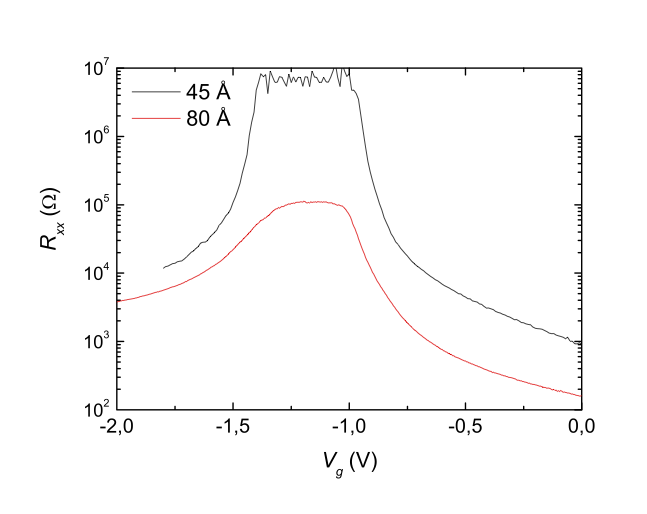
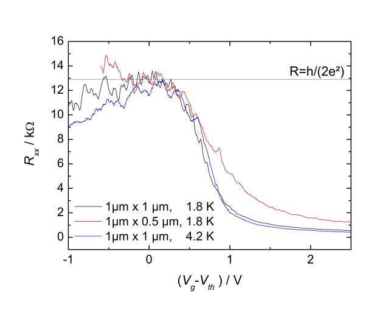
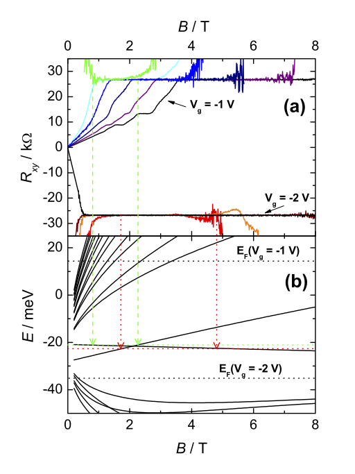
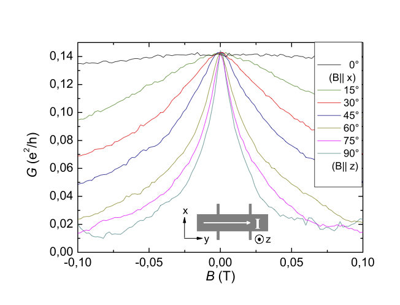

```python
import sys

sys.path.append("../../code")
from init_mooc_nb import *

init_notebook()
%output size = 150

import warnings

warnings.simplefilter("ignore", UserWarning)

bhz_parameters = {
    "topo": {"A": 0.5, "B": 1.00, "D": 0.0, "M": 0.2},
    "topo2": {"A": 0.5, "B": 1.00, "D": 0.0, "M": 1.0},
    "triv": {"A": 0.5, "B": 1.00, "D": 0.0, "M": -0.2},
    "lead": {"A_lead": 1.5, "B_lead": 1.00, "D_lead": 0.0, "M_lead": 0.0},
}

# Onsite and hopping functions for the BHZ model.
# Sometimes, we use different BHZ parameters in the
# scattering region and leads, so we treat them
# separately.
def _onsite(site, p, is_lead=False):
    if is_lead:
        B, D, M = p.B_lead, p.D_lead, p.M_lead
    else:
        B, D, M = p.B, p.D, p.M
    return (
        (M - 4 * B) * pauli.s0sz
        - 4 * D * pauli.s0s0
        + p.ez_y * np.kron(pauli.sy, (pauli.s0 + pauli.sz) / 2)
    )


def onsite(site, p):
    return _onsite(site, p, is_lead=False)


def onsite_lead(site, p):
    return _onsite(site, p, is_lead=True)


def _hopx(site1, site2, p, is_lead=False):
    if is_lead:
        A, B, D = p.A_lead, p.B_lead, p.D_lead
    else:
        A, B, D = p.A, p.B, p.D
    return B * pauli.s0sz + D * pauli.s0s0 + 1j * A * pauli.szsx


def hopx(site1, site2, p):
    return _hopx(site1, site2, p, is_lead=False)


def hopx_lead(site1, site2, p):
    return _hopx(site1, site2, p, is_lead=True)


def _hopy(site1, site2, p, is_lead=False):
    if is_lead:
        A, B, D = p.A_lead, p.B_lead, p.D_lead
    else:
        A, B, D = p.A, p.B, p.D
    return B * pauli.s0sz + D * pauli.s0s0 - 1j * A * pauli.s0sy


def hopy(site1, site2, p):
    return _hopy(site1, site2, p, is_lead=False)


def hopy_lead(site1, site2, p):
    return _hopy(site1, site2, p, is_lead=True)


def two_terminal(L, w):
    """ Make a two terminal system with the BHZ model. """

    def shape(pos):
        (x, y) = pos
        return 0 <= y < w and 0 <= x < L

    def lead_shape(pos):
        (x, y) = pos
        return 0 <= y < w

    lat = kwant.lattice.square()
    syst = kwant.Builder()

    def onsite_two_term(site, p):
        return onsite(site, p) - p.mu * np.eye(4)

    def onsite_two_term_lead(site, p):
        return onsite_lead(site, p) - p.mu_lead * np.eye(4)

    # Scattering region
    syst[lat.shape(shape, (0, 0))] = onsite_two_term
    syst[kwant.HoppingKind((1, 0), lat)] = hopx
    syst[kwant.HoppingKind((0, 1), lat)] = hopy

    # Leads
    lead = kwant.Builder(kwant.TranslationalSymmetry((-1, 0)))
    lead[lat.shape(lead_shape, (0, 0))] = onsite_two_term_lead
    lead[kwant.HoppingKind((1, 0), lat)] = hopx_lead
    lead[kwant.HoppingKind((0, 1), lat)] = hopy_lead

    # Attach leads
    syst.attach_lead(lead)
    syst.attach_lead(lead.reversed())

    return syst


def bhz(w=None):
    """Translationally invariant BHZ system with a infinite or fixed width w."""
    lat = kwant.lattice.square()
    if w is None:
        syst = kwant.Builder(kwant.TranslationalSymmetry(*lat.prim_vecs))
        syst[lat.shape(lambda pos: True, (0, 0))] = onsite
    else:

        def ribbon_shape(pos):
            (x, y) = pos
            return 0 <= y < w

        sym = kwant.TranslationalSymmetry((1, 0))
        syst = kwant.Builder(sym)
        syst[lat.shape(ribbon_shape, (0, 0))] = onsite

    syst[kwant.HoppingKind((1, 0), lat)] = hopx
    syst[kwant.HoppingKind((0, 1), lat)] = hopy
    return syst


def G_mu_plot(p, mus, color):
    syst = two_terminal(40, 40).finalized()
    G = [kwant.smatrix(syst, energy=0.0, args=[p]).transmission(1, 0) for p.mu in mus]
    kdims = [r"$\mu$", r"G $[e^2/h]$"]
    plot = holoviews.Path((mus, np.array(G)), kdims=kdims, label="Conductance")
    ticks = {"xticks": [-0.8, -0.4, 0, 0.4, 0.8], "yticks": [0, 2, 4, 6, 8, 10]}
    return plot[:, 0:10].opts(plot=ticks, style={"color": color})


def G_Ez_plot(p, E_zs):
    syst = two_terminal(40, 20).finalized()
    G = [
        kwant.smatrix(syst, energy=0.0, args=[p]).transmission(1, 0) for p.ez_y in E_zs
    ]
    kdims = [r"$E_z$", r"G $[e^2/h]$"]
    plot = holoviews.Path((E_zs, np.array(G)), kdims=kdims, label="Conductance")
    ticks = {"xticks": [0, 0.05, 0.10, 0.15], "yticks": [0, 0.5, 1.0, 1.5, 2.0]}
    return plot[:, 0:2].opts(plot=ticks)
```

# Introduction


```python
MoocVideo("-HRBuCgOUvs", src_location="5.2-intro")
```

This topic is special, since in order to meaningfully discuss experimental progress we need to do something we didn't do before in the course: we will show you the measurements and compare them with the *simple* theoretical expectations. Like this we will see what agrees and what doesn't.

All the figures showing the experiments are copyright Physical Society of Japan (2008), published in [
J. Phys. Soc. Jpn. 77, 031007 (2008)](http://journals.jps.jp/doi/abs/10.1143/JPSJ.77.031007) by  Markus König, Hartmut Buhmann, Laurens W. Molenkamp, Taylor Hughes, Chao-Xing Liu, Xiao-Liang Qi, and Shou-Cheng Zhang. They are available under CC-BY-NC-SA 4.0 International license.

# Two limits: Mexican hat and weak pairing

We just learned that topological insulators with inversion symmetry were simpler to think about. We will now use the  topological invariant to find a simple recipe for finding topological insulators. All we need to do is somehow vary the parity of the occupied states. One fact of nature that comes to our aid in this is that electrons in semiconductors typically occupy even parity $s$-orbitals and odd parity $p$-orbitals.

If we look up the bandstructure of a typical "non-topological" semiconductor, the highest valence-band is of odd parity and the lowest conduction band is even parity. As one moves down the periodic table to heavier elements with larger spin-orbit coupling the odd parity orbital switches spots with the even parity orbital. This *band inversion* is the domain where we can hope to find topological insulators.

Now you might think that all we have to do is go down the periodic table to heavier elements and just pick some material like HgTe (actually used in the creation of QSHE), but that's not all yet. We still need to make a quantum well out of this semiconductor to make the system two-dimensional. This leads to two dimensional bands derived from the three dimensional band structure.

By carefully choosing the widths, it is possible to invert the odd and even parity bands. We saw from the last unit, that such a band-inversion leads to a topologically non-trivial value of the parity invariant. Right around the topological transition, the even and odd parity bands are degenerate. Thus, we can follow the discussion in the last unit to derive domain wall states at the edges.

We can write down the simplest Hamiltonian for an even and an odd parity band in a basis $|e,\sigma\rangle$ and $|o,\sigma\rangle$ in a block form 

$$H({\bf k})=\left(\begin{array}{cc}\epsilon_e({\bf k})&\Delta({\bf k})\\\Delta^\dagger({\bf k})&\epsilon_o({\bf k})\end{array}\right),$$

where $\Delta({\bf k})$ is the $2\times 2$ hybridization matrix. Inversion and time-reversal symmetries imply that $\Delta({\bf k})=-\Delta(-{\bf k})$ is odd under inversion and even under time-reversal.  Here we will focus on one such model, $\Delta({\bf k})=\alpha\sigma_z(k_x+i k_y)$, which we call the Bernevig-Hughes-Zhang model. 

Since the even band is electron-like, we approximate the even-band dispersion $\epsilon_e({\bf k})$
as $\epsilon_e({\bf k}) = \delta_e + m_e k^2$, while we take the odd parity dispersion to be $\epsilon_o({\bf k})= \delta_o - m_o k^2$ for simplicity. The band inversion happens when $\delta_e < \delta_o$.

The spectrum of this Hamiltonian is very similar to that of a Chern insulator (after all we essentially just doubled the degrees of freedom). Just like in most topological systems, the shape of the band structure depends on the relative strength of band inversion and inter-band coupling.

So below we see a qualitative band structure of one of the QSHE insulators, HgTe/CdTe quantum well, compared with the band structure of InAs/GaSb quantum well.


```python
p_triv = SimpleNamespace(mu=0, ez_y=0.0, mu_lead=0.0, A=0.5, B=1.0, D=-0.1, M=-0.2)
p_topo = SimpleNamespace(mu=0, ez_y=0.0, mu_lead=0.0, A=0.5, B=1.0, D=-0.1, M=1.5)
syst = bhz()
kwargs = {"zticks": [-8, -4, 0, 4, 8]}
(
    spectrum(syst, p_triv, **kwargs).relabel("Trivial")
    + spectrum(syst, p_topo, **kwargs).relabel("Topological")
)
```

In the last unit, we understood the nature of the edge modes near the topological phase transition, where a doubled Dirac model was appropriate. Deep in the strongly band-inverted topological regime, the bulk band structure has a mexican hat structure with the gap proportional to $\alpha$. 

The edge modes in this regime are quite different in structure from those near the topological transition. To see this, let us first set $k_y=0$ in the Hamiltonian. If we set $\alpha=0$ then there are two fermi points where the dispersion is roughly linear - let us label these points by $\tau_z=\pm 1$. We can describe the edge of the system, by assigning boundary conditions to the $k_x=\pm k_F$ modes in terms of time-reversal invariant phase-shifts. 

The bulk solutions near $k_x\sim\pm k_F$ can be written as $\psi_\pm(x)=e^{-x/\xi}\psi_\pm(0)$. Matching boundary conditions, we find that a zero energy pair of edge solutions exists in the case of inverted bands. These solutions differ from the ones in the Dirac limit by the presence of the oscillating part of the wave function.

# Quantized conductance and length dependence

Unlike in the case of Majoranas, not much thinking is required to figure out the relevant signature of the quantum spin Hall effect. There is a pair of modes on each edge of the sample that is protected from backscattering. All the other modes are gapped or backscattered, so the edge states are the only ones to carry current. This current will not suffer from backscattering.

If we consider the simplest case, a sample with only two terminals, then Landauer's formula together with the absence of backscattering gives the conductance $G_0=2 e^2/h$.

When we move the Fermi level outside of the bulk gap, the bulk becomes conducting, and so the conductance increases.

We end up with this situation:


```python
p_topo = SimpleNamespace(
    mu=None, ez_y=0.0, mu_lead=1.5, A=0.5, B=1.0, D=0.0, M=0.2, **bhz_parameters["lead"]
)
p_triv = SimpleNamespace(
    mu=None,
    ez_y=0.0,
    mu_lead=1.5,
    A=0.5,
    B=1.0,
    D=0.0,
    M=-0.2,
    **bhz_parameters["lead"]
)

kwargs = {
    "k_x": np.linspace(-np.pi / 3, np.pi / 3, 51),
    "xticks": [(-np.pi / 3, r"$-\pi/3$"), (0, "0"), (np.pi / 3, r"$\pi/3$")],
    "yticks": [-1.5, -1.0, -0.5, 0.0, 0.5, 1.0, 1.5],
    "ylims": (-1.5, 1.5),
}

syst = bhz(w=20)
spec_topo = spectrum(syst, p_topo, **kwargs).relabel("spectrum (topo)")
spec_triv = spectrum(syst, p_triv, **kwargs).relabel("spectrum (triv)")
mus = np.linspace(-0.8, 0.8, 50)
HLines = holoviews.HoloMap({mu: holoviews.HLine(mu) for mu in mus}, kdims=[r"$\mu$"])
VLines = holoviews.HoloMap({mu: holoviews.VLine(mu) for mu in mus}, kdims=[r"$\mu$"])
G_triv = G_mu_plot(p_triv, mus, "b")
G_topo = G_mu_plot(p_topo, mus, "r")

(G_triv * (G_topo * VLines) + spec_topo * HLines + spec_triv * HLines)
```

Here on the left we see a comparison between the conductances of a trivial (blue curve) and a topological (red curve) insulator as a function of chemical potential. The other two panels show the spectra of a quantum spin Hall insulator in the topological and trivial phases. As we expected, conductance is quantized when the chemical potential is inside the band gap of a topological system.

Let's now see what can be measured experimentally.



(copyright JPS, see license in the beginning of the chapter)

What you notice is that the maximum resistance for the 4.5 nm thick quantum well is much higher than for the 8 nm thick well. Given that theory predicts that the HgTe quantum wells described by Michael Wimmer in his video are topological when their thickness is between 6.3 nm and 12 nm, this measurement suggests that the lower resistance of the 8 nm thick well might be due to edge conductance. But even though it is the lower of the two, you might complain that the resistance of the 8 nm well is closer to $100$ $k\Omega$ than the predicted $12$ $k\Omega$ from the quantum of conductance.

The black curve here is the resistance of a trivial insulator, and the red one should be that of a topological one. The resistance of a trivial insulator becomes very high as expected, and there is a plateau-like feature in the topological regime.

Fortunately, it was revealed in further experiments by the Wurzburg group, that by reducing the length of the sample from length $L=20$ $\mu m$ to $L=1$ $\mu m$, the conductance maximum rises to about $12.9$ $k\Omega$:



(copyright JPS, see license in the beginning of the chapter)

We see something different from what we expected: the average resistance value at the plateau is correct, but only within 10% precision, very different from the $10^{-8}$ accuracy of the quantum Hall effect.

This difference most likely originates from backscattering. In the quantum Hall effect, backscattering is prohibited by the absence of modes going in the other direction. In the quantum spin Hall effect however, the protection is much weaker and is merely due to Kramers theorem.

The exact origin of the backscattering is hard to understand. It could be inelastic scattering that does not preserve energy, or it could also be some residual magnetic impurities, which break time reversal symmetry. In both cases, Kramers theorem does not hold. One of the papers that we suggest for review proposes an interesting theory for the origin of the backscattering, while another reports measurements of InAs/GaSb quantum well, where conductance seems much better quantized.

Regardless of the exact origin of backscattering, at any finite temperature, there is an inelastic scattering length $l_\phi$ beyond which we do not expect any protection from scattering. When the edge length $L$ is larger than $l_\phi$, we expect the edge to turn into an incoherent conductor with resistance of $(e^2/h) l_\phi/L$. 

In principle, this allows us to measure $l_\phi$ for the quantum spin hall edges by looking at the length dependence of the conductance. Indeed, experiments find that small samples have conductance close to $G_0$, while in large samples the conductance is suppressed.

# Landau levels

We learned that the key ingredient to obtain an inversion symmetric topological insulator is band inversion - an electron-like band with a positive effective mass and a hole-like band with a negative effective mass are inverted.

The standard way to distinguish electrons from holes is to measure the sign of the Hall resistance, which is positive for electrons and negative for holes. Hence, we expect to measure a change in the sign of the Hall conductance as we change the position of the Fermi level from being above to being below the band gap.

In the first plot below, you see traces of the Hall resistance of a quantum spin Hall sample as a function of the applied magnetic field, for several values of the gate voltage, given by different colors. You see that for $V_g=-1$ V the Hall resistance is positive, while for $V_g = -2 V$ the resistance is negative. These are the two black traces. They both exhibit a very well formed $\nu=1$ quantum Hall plateau for high enough fields, and a vanishing Hall resistance for zero magnetic field. This is the standard, expected behavior.

For some traces between these two values, the resistance shoots up to very high values. This is because the Fermi level is in the middle of the band gap. As expected, we thus observe insulating behavior.

However, you may notice something interesting. Let's focus for instance on the green and red traces taken for two very close values of $V_g$. Because these correspond to Fermi levels in the middle of the band gap, they show a very high resistance, except for a range of magnetic field values, where they also exhibit a quantum Hall plateau!

This proves what we hoped to find: there is a Landau level of electrons that crosses with a Landau level of holes.



(copyright JPS, see license in the beginning of the chapter)

As shown in the lower panel, this particular feature is due to the unique structure of Landau levels which you obtain in the presence of a band inversion.

The Landau levels of an electron-like band have a positive slope as a function of magnetic field, while those of a hole-like band have a negative slope. In a trivial bandstructure, all negative energy levels would bend down as a function of magnetic field, while all positive energy levels would bend up. As a consequence, if you place the Fermi level in the middle of the band gap and increase the magnetic field, no Landau level will ever cross the Fermi level.

However, in the presence of a band inversion, you obtain what is shown in the figure: the lowest Landau levels coming from the inverted bands go in the “wrong” direction. At some value of the magnetic field, they must cross. Furthemore, they will both cross the Fermi level if it is in the middle of the zero-field band gap.

Due to this fact, one observes a Hall effect in a certain range of fields, even when the Fermi level is placed in the middle of the zero-field band gap. And indeed, by comparing the experimental results with the expected behavior of the Landau levels, you see that the positions of the Fermi-level crossings coincide with the re-entrant Hall plateaus of the experimental traces - as marked by the green and red arrows.

As a further confirmation that this effect is due to band inversion, this behavior was only observed in samples with a thickness above the expected threshold value to obtain a quantum spin Hall phase, and never in samples with a smaller thickness.

# Localization of the edge states by magnetic field

Theoretically, the hallmark of the topological insulator is the quantized conductance of the edge states that are protected from elastic backscattering. In the last unit, we learned that the key to this protection is time-reversal symmetry. Therefore, breaking time reversal symmetry by for example applying a magnetic field, should suppress the quantized conductance.

We can think about this more explicitly by considering a simple model for the helical edge states with a magnetic field $\bf B$:

$$H=v_F k_x\sigma_z+{\bf B}\cdot {\bf \sigma},$$

where $\bf \sigma$ are Pauli matrices representing the spin degree of freedom at the edge. This is what we get from the BHZ model, which conserves spin. For more general models we would interpret $\bf \sigma$ as a pseudo-spin degree of freedom, which is odd under time-reversal.

If we consider the simple case of a magnetic field ${\bf B}=B {\bf x}$ along the x-direction, we find that the edge spectrum $E=\pm\sqrt{v_F^2 k_x^2+B^2}$ becomes gapped. Clearly, the edge becomes insulating if we set the chemical potential at $E=0$.

We can very easily calculate that this is the case if we plot the conductance of the QSHE model as a function of magnetic field:


```python
p = SimpleNamespace(mu=0, ez_y=0.0, mu_lead=1.5, **bhz_parameters["topo2"])

for key, value in bhz_parameters["topo2"].items():
    # setting the parameters for the lead the same as the scattering system
    p.__dict__[key + "_lead"] = value

syst = bhz(w=20)

kwargs = {
    "k_x": np.linspace(-np.pi / 3, np.pi / 3, 51),
    "ylims": (-1.5, 1.5),
    "xticks": [(-np.pi / 3, r"$-\pi/3$"), (0, r"$0$"), (np.pi / 3, r"$\pi/3$")],
    "yticks": [-1.5, -1.0, -0.5, 0.0, 0.5, 1.0, 1.5],
    "title": lambda p: "Band structure",
}

E_zs = np.linspace(0, 0.15, 50)
VLines = holoviews.HoloMap(
    {ez_y: holoviews.VLine(ez_y) for ez_y in E_zs}, kdims=[r"$E_z$"]
)
spectra = holoviews.HoloMap(
    {p.ez_y: spectrum(syst, p, **kwargs) for p.ez_y in E_zs}, kdims=[r"$E_z$"]
)
G_Ez_plot(p, E_zs) * VLines + spectra * holoviews.HLine(0)
```

However, even if we consider energies $E>B$ above the gap, the eigenstates at $\pm k_x$ are no longer Kramers' pairs, i.e. related by time-reversal symmetry. Therefore, any mechanism which changes momentum by $2 k_x$ can backscatter electrons from left movers to right movers. 

Edges of semiconductors are typically quite disordered - so we expect the random potential at the edge to provide "elastic backscattering" that can change the momentum without changing the energy. Such backscattering, in addition to any other "inelastic backscattering" by phonons etc, would decrease the conductance of the edge from the ideal quantized value. If we set $B=0$, elastic back-scattering that can occur at finite $B$ is forbidden, so we generally expect the application of a magnetic field to reduce conductance of the edge.

We see below that indeed the conductance of the $L=20\,\mu m$ device is strongly reduced by the application of a magnetic field: 



(copyright JPS, see license in the beginning of the chapter)

However, we notice that this effect seems to work only when the magnetic field is perpendicular to the sample. In-plane magnetic fields do not seem to do a whole lot (there is an effect, but much larger fields are required). According to our model Hamiltonian, an in-plane field should have opened a gap, while a perpendicular field which adds a term proportional to $\sigma_z$ should have not done anything.

So, while the experiment sees something similar to what we hoped to find using a simple theory, the effect of the magnetic field seems reversed. There may be several explanations for this phenomenon, such as a presence of extra terms in the Hamiltonian that rotate the spins of the edge states without breaking time-reversal symmetry.

You might be worried that the suppression of conductance is only shown for the long device, which does not show quantized conductance. If you are, then you are absolutely right in worrying about this :-)

Localization of QSHE edge states by magnetic field is relatively poorly understood, and we are not aware of a final experiment that would prove its existence or tell us in details what it is that happens at the QSHE edge in a magnetic field. As you will learn in two weeks, opening the gap by magnetic field opens new pathways for the creation of Majoranas, and so it is still a very important direction of research.


```python
question = (
    "Why did we not see a similar suppression of conductance with magnetic field in the case of  "
    "the quantum Hall effect in week 3?"
)

answers = [
    "The quantum Hall effect appeared in much higher quality samples.",
    "There was no spin in the quantum Hall effect, so the magnetic field could not couple to anything.",
    "The topological protection of quantum Hall edges does not rely on time-reversal, unlike quantum spin "
    "Hall edges.",
    "The suppression here arises from inelastic scattering, which could not arise in the quantum Hall case.",
]

explanation = (
    "The magnetic field dependence here arises from the fact that B breaks time-reversal symmetry, which is  "
    "required for the protection of edge states in the quantum spin Hall effect. "
)

MoocMultipleChoiceAssessment(
    question=question, answers=answers, correct_answer=2, explanation=explanation
)
```

# Summary


```python
MoocVideo("Kop4zXWQ1Zc", src_location="5.2-summary")
```

**Questions about what you just learned? Ask them below!**


```python
MoocDiscussion("Questions", "QSHE - experiments")
```
